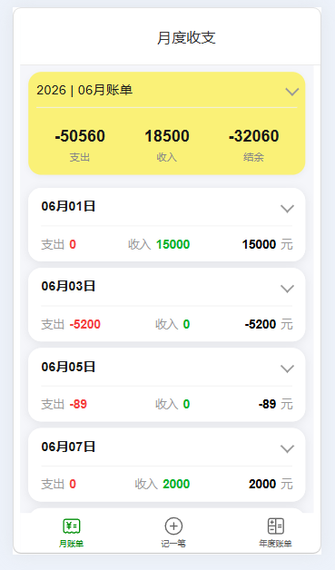

# 📁 项目目录结构

## 1. React 评论组件示例[基础]
**项目路径：** `./react-comment-demo/`

---

## 2. 账本APP应用 [React Router]
**项目路径：** `./4.day-ReactRouter/`

---
## 3. 博客网站
**项目路径：** `./6.day-login/6.day-demo/`

### 📌 说明
- 第一个项目为 **React 评论功能** 的演示demo
- 第二个项目为 **React Router 路由**， **Redux**, **AntD-Mobile** 的账本管理应用
- 第三个项目为 **AntD design**的网站
- 除了第一个用CRA 创建的react 项目外， 其他都是用Vite + TypeScript创建的React项目
- 请确保在对应目录下安装依赖后启动项目